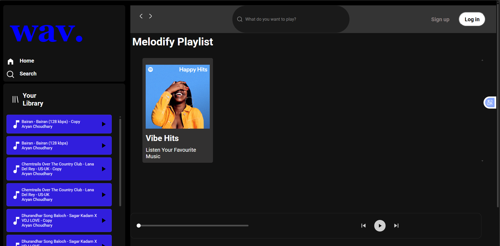
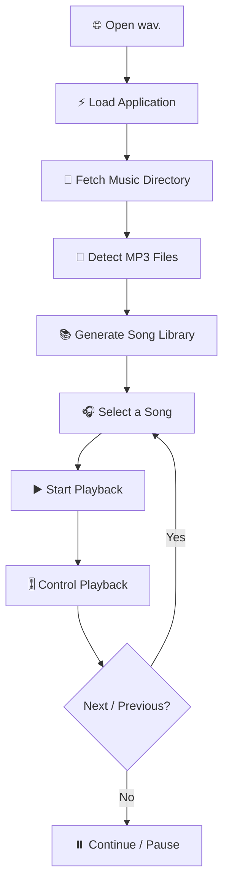

<div align="center">

# <font color="#5865F2">wav.</font>

### 🎵 A Modern Web-Based Music Player

**Listen. Discover. Enjoy.**

A sleek, dark-themed music player built with **HTML, CSS & JavaScript**, designed to deliver a smooth and immersive music-listening experience directly in your browser.

<br>

[](#)
[](#)
[](#)

<br>



</div>

---

# 🎧 About wav.

**wav.** is a browser-based music player created with a focus on **clean UI, dynamic music handling, and an immersive listening experience**.

The application combines a modern dark interface with a vibrant blue visual identity to create a music-player experience inspired by modern streaming platforms.

From dynamically loading songs to controlling playback through the custom player interface, **wav.** is built to explore how a real-world music application works using core web technologies.

> **wav. — Your music. Your vibe.**

---

# ✨ Features

<div align="center">

|        🎵 Feature        | ⚡ Description                                         |
| :----------------------: | :---------------------------------------------------- |
|    🎧 **Music Player**   | Play and control your favourite tracks                |
|    📚 **Your Library**   | Access dynamically loaded songs                       |
|  🔎 **Search Interface** | Search-style interface for finding music              |
| ▶️ **Playback Controls** | Play, pause, previous and next controls               |
|    ⏱️ **Progress Bar**   | Track and control the current playback position       |
|   🎼 **Dynamic Songs**   | Songs are loaded dynamically from the music directory |
|      🌙 **Dark UI**      | Modern dark-themed music interface                    |
|   💙 **wav. Branding**   | Custom blue visual identity                           |
| 📱 **Responsive Design** | Designed with different screen sizes in mind          |

</div>

---

# 🖥️ Interface

### 🏠 Home & Library

The sidebar provides quick access to the main sections of the application.

```text
┌───────────────────────────┐
│                           │
│          wav.             │
│                           │
│   🏠  Home                │
│   🔍  Search              │
│                           │
│   ─────────────────────   │
│                           │
│   📚  Your Library        │
│                           │
│   🎵  Song 01             │
│   🎵  Song 02             │
│   🎵  Song 03             │
│                           │
└───────────────────────────┘
```

### 🎼 Playlist

The main content area displays the current playlist and music collection.

### 🎚️ Music Player

The bottom player provides the main playback controls, including:

* Previous track
* Play / Pause
* Next track
* Playback progress
* Current track information
* Track duration

---

# 🎨 Design Philosophy

The visual identity of **wav.** is built around a simple concept:

### **Dark + Minimal + Electric**

<div align="center">

| 🎨 Element              | Style              |
| :---------------------- | :----------------- |
| 🖤 Background           | Deep Dark          |
| 💙 Primary Brand        | Electric Blue      |
| 🤍 Text                 | White / Light Gray |
| 🩶 Secondary UI         | Dark Gray          |
| 🟦 Interactive Elements | Blue               |
| 🎵 Overall Style        | Modern & Minimal   |

</div>

The dark interface keeps the focus on the music while the blue `wav.` branding provides a strong visual identity.

---

# 🛠️ Tech Stack

<div align="center">


</div>

### HTML5

Used for:

* Page structure
* Sidebar
* Navigation
* Playlist
* Player controls
* Audio elements

### CSS3

Used for:

* Dark theme
* Layout
* Flexbox
* Cards
* Buttons
* Scrollbars
* Responsive styling
* Visual effects

### JavaScript

Used for:

* Music loading
* DOM manipulation
* Audio control
* Playlist interaction
* Event handling
* Dynamic song rendering
* Fetching music files

---

# ⚙️ How wav. Works

The basic application flow looks like this:



---

# 🔄 Dynamic Song Fetching

One of the important parts of **wav.** is dynamically loading songs instead of manually writing every song inside the HTML.

The application uses JavaScript's **Fetch API** to access the music directory.

```javascript
async function getSongs() {
    let response = await fetch("http://127.0.0.1:5500/songs/");
    let data = await response.text();

    let div = document.createElement("div");
    div.innerHTML = data;

    let links = div.getElementsByTagName("a");

    let songs = [];

    for (let index = 0; index < links.length; index++) {
        const element = links[index];

        if (element.href.endsWith(".mp3")) {
            songs.push(element.href);
        }
    }

    return songs;
}
```

This allows the application to detect available `.mp3` files and use them dynamically.

---

# 📁 Project Structure

```text
wav/
│
├── 📄 index.html
├── 🎨 style.css
├── 🎨 utility.css
├── ⚡ script.js
│
├── 🎵 songs/
│   ├── song-01.mp3
│   ├── song-02.mp3
│   ├── song-03.mp3
│   └── ...
│
├── 🖼️ assets/
│   ├── logo.svg
│   ├── home.svg
│   ├── search.svg
│   ├── playlist.svg
│   ├── play.svg
│   └── ...
│
└── 📘 README.md
```

---

# 🚀 Getting Started

Follow these steps to run **wav.** locally.

## 1️⃣ Clone the Repository

```bash
git clone https://github.com/YOUR-USERNAME/wav.git
```

## 2️⃣ Open the Project

```bash
cd wav
```

Open the project in **Visual Studio Code**.

## 3️⃣ Add Music

Place your `.mp3` files inside:

```text
songs/
```

For example:

```text
songs/
├── Bairan.mp3
├── Chemtrails.mp3
├── Dhurandhar.mp3
└── ...
```

## 4️⃣ Start a Local Server

Because the application dynamically fetches files from the `songs` directory, run it using a local development server.

### VS Code + Live Server

Install the **Live Server** extension and select:

```text
Right Click → Open with Live Server
```

The application will open at a local address similar to:

```text
http://127.0.0.1:5500/
```

## 5️⃣ Start Listening 🎧

Open the application and select any available song from **Your Library**.

---

# 🧠 What I Learned

Building **wav.** helped me understand practical frontend development concepts beyond simply writing HTML and CSS.

### 🌐 Frontend

* HTML structure
* CSS layouts
* Flexbox
* Responsive design
* UI component styling
* Dark-theme design

### ⚡ JavaScript

* Variables and functions
* Arrays
* Loops
* DOM manipulation
* Events
* Async / Await
* Fetch API
* Dynamic HTML generation
* Audio handling

### 🎵 Web Audio

The project also helped me understand how browser-based audio playback can be controlled using JavaScript.

---

# 🐛 Debugging & Development

During development, one of the important challenges was dynamically fetching songs from the local music directory.

The browser's developer tools can be used to debug the application.

### Console

```text
F12 → Console
```

Useful for checking JavaScript output:

```javascript
console.log(response);
console.log(songs);
```

### Network

```text
F12 → Network
```

Check whether:

```text
songs/
```

is being requested successfully.

This makes it easier to identify problems related to:

* Incorrect file paths
* Local server configuration
* Missing `.mp3` files
* JavaScript errors
* Fetch failures

---

# 🗺️ Development Roadmap

The project is continuously evolving.

### ✅ Completed / Working

* [x] Music player UI
* [x] Dark-themed interface
* [x] Sidebar navigation
* [x] Your Library section
* [x] Dynamic song loading
* [x] Audio playback
* [x] Playlist interface
* [x] Playback progress
* [x] Previous / Next controls

### 🚧 In Development

* [ ] Search functionality
* [ ] Improved mobile responsiveness
* [ ] Better playlist management
* [ ] Song metadata
* [ ] Album artwork integration
* [ ] Improved animations

### 🔮 Future Ideas ...

* [ ] 🔀 Shuffle
* [ ] 🔁 Repeat
* [ ] ❤️ Favourite songs
* [ ] 📚 Multiple playlists
* [ ] 🔊 Volume control
* [ ] 💾 LocalStorage support
* [ ] 👤 User accounts
* [ ] ☁️ Backend integration
* [ ] 🗄️ Database integration
* [ ] 📱 Progressive Web App support

---

# 📸 Screenshots

## 🎧 Main Player


> Add additional screenshots here as the project grows.

---

# 🎯 Project Goals

The main goals of **wav.** are:

```text
        ┌──────────────────────┐
        │       wav. 🎵        │
        └──────────┬───────────┘
                   │
       ┌───────────┼───────────┐
       ▼           ▼           ▼
    Learn       Build       Improve
       │           │           │
       ▼           ▼           ▼
   JavaScript   UI/UX      Real-world
   Concepts     Design     Development
       │           │           │
       └───────────┼───────────┘
                   ▼
             🚀 Better Web Apps
```

---

# 🔐 Copyright & Music

**wav.** is a personal/educational software project.

The application itself does not claim ownership of any music included in local development files.

If copyrighted music is used, ensure that you have the appropriate rights or permission to use and distribute it.

---

# 🤝 Contributors

<div align="center">

### Built with collaboration, creativity & code. 💙

**wav.** is a collaborative music-player project developed with a shared focus on clean design, smooth functionality, and a great listening experience.

<br>

<table>
<tr>

<td align="center" width="50%">

### 👨‍💻 Aryan Raj

<a href="https://github.com/aryanchoudhary001">
  
</a>

<br>

**Developer & Project Lead**

<a href="https://github.com/aryanchoudhary001">
  
</a>

</td>

<td align="center" width="50%">

### 👨‍💻 Ritesh Yadav

<a href="https://github.com/RITESH-GITHUB-USERNAME">
  
</a>

<br>

**Developer & Contributor**

<a href="https://github.com/RITESH-GITHUB-USERNAME">
  
</a>

</td>

</tr>
</table>

<br>

---

### 🎵 Our Contribution

We worked together on **designing, developing, testing, and improving wav.**, combining frontend development, UI design, JavaScript functionality, and continuous experimentation to build the application. music listening

<br>

### 💙 Built Together. Played Everywhere.

# `wav.`

**Aryan Raj × Ritesh Yadav**

</div>


```bash
# Fork the repository

# Create a feature branch
git checkout -b feature/amazing-feature

# Make your changes

# Commit
git commit -m "Add amazing feature"

# Push
git push origin feature/amazing-feature
```

Then open a **Pull Request**.

---

# ⭐ Show Your Support

If you like **wav.**, consider giving the repository a ⭐.

It helps support the project and encourages further development.a

<div align="center">

### 🎵 Keep listening.

# <font color="#5865F2">wav.</font>

**Your music. Your vibe.**

<br>

Made with ❤️ and JavaScript

</div>
